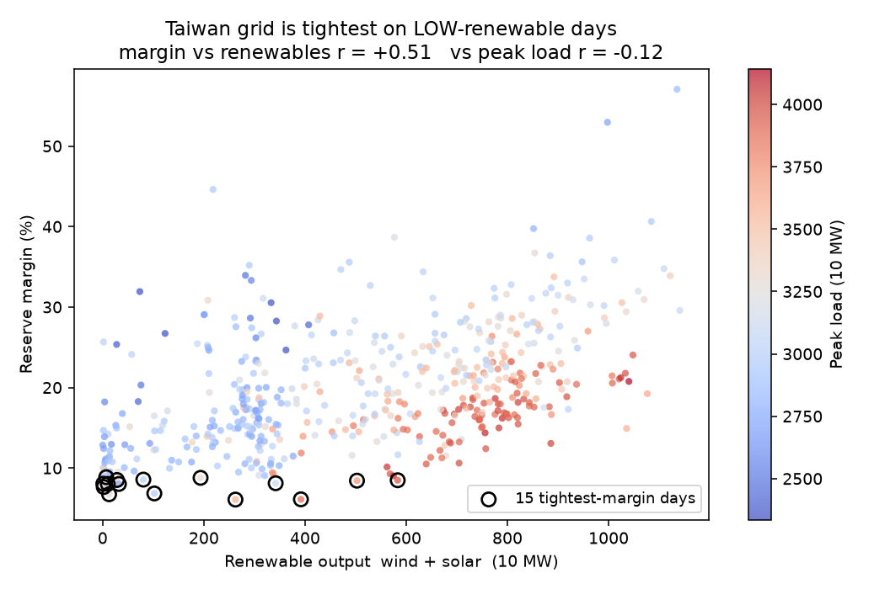
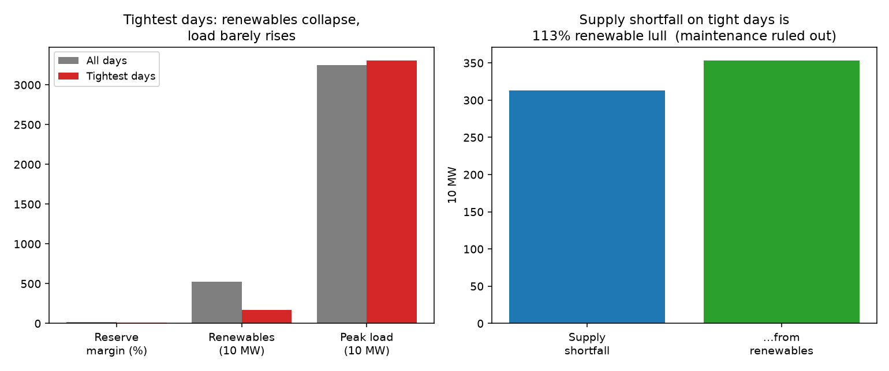
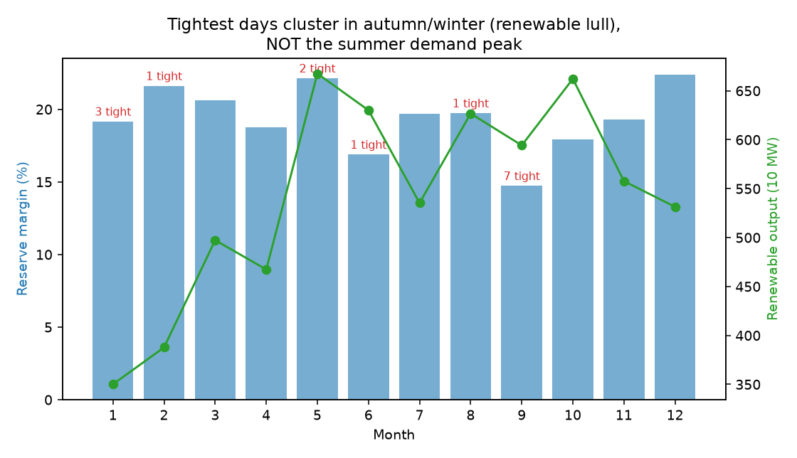

# 台灣電網最吃緊的日子，是「再生能源低谷」還是一條會計恆等式？

天真的答案看起來很漂亮：2025–2026 年，備轉容量率最低（最吃緊）的日子和再生能源低谷相關
（r = +0.51），和尖峰負載幾乎無關（r = −0.12），而且集中在秋冬、與夏季用電尖峰脫鉤。
看起來是一個反直覺、對台灣很重要的發現。

真正的答案是：這個相關大半是會計恆等式，不是因果。



## 天真的相關（看起來很有說服力）

| | 最吃緊 15 天 | 全體平均 |
|---|---|---|
| 備轉容量率 | 7.8% | 19.7% |
| 再生能源（風 + 光，萬瓩） | 170 | 524（只剩 1/3） |
| 尖峰負載（萬瓩） | 3310 | 3245（只高一點） |

- 備轉率對再生能源相關 r = +0.51，對尖峰負載只有 −0.12。
- 標準化迴歸（同時控制）：太陽能 +0.97、風力 +0.27、負載 −0.69。
- 條件備轉率：只有高負載時 18.6%、只有低再生時 12.1%（一般日 19.7%）。

它甚至撐過了「歲修」這一關：吃緊日是供給短（−313 萬瓩）而非需求高（+65），而這個供給缺口有
113% 由再生能源解釋（火力、核能在吃緊日反而更多），所以看似不是電廠歲修、就是再生低谷。



## 為什麼這是假的：會計恆等式

- 備轉率的定義就是 (供給 − 負載) / 負載。本資料裡 `corr(備轉率, (供給−負載)/負載) = +1.00`。
  這不是巧合，是定義本身。
- 而再生能源本來就是「供給」的組成：`corr(供給, 再生) = +0.77`。
- 兩者合起來，「再生低則備轉低」有一大半只是加減法，不是新發現。
- 去季節之後，備轉率對負載的相關掉到 −0.03；而備轉率對「淨負載（負載 − 再生）」的相關是
  −0.57，遠強於對毛負載的 −0.12。整件事化約為「備轉率追隨淨負載」，這是電網教科書常識。

`analyze.py` 的第 ⑥ 段把這條稽核攤開，可直接重跑。

## 唯一站得住的弱結論

毛需求尖峰預測不了吃緊日（相關只有 −0.12），因為在高再生時代供給和需求會一起動（夏天太陽能
高、負載也高）。所以吃緊日和夏季尖峰脫鉤，落在秋冬的再生低谷。



這點對「別只把備轉留給夏季尖峰」的排程有參考價值，但它是描述性的，不是「再生低谷是壓垮備轉
的原因」那種因果宣稱。

## 這份為什麼還公開

它是「相關性誤讀」的第一個、也是最像教科書的案例：一個 r = +0.51、還撐過歲修檢驗的相關，
最後死在一條會計恆等式上。整個過程，包含會騙人的那一步，都留在 `analyze.py` 裡可重跑。

## 怎麼跑

```bash
uv venv --python 3.12 && source .venv/bin/activate
uv pip install -r requirements.txt
python run.py          # 抓資料、分析、混淆稽核、出圖
```

免金鑰、免登入；台電資料自 [data.gov.tw](https://data.gov.tw) 動態取得並快取到 `data/`。

## 資料來源（全開放）

| 資料 | 來源 | 內容 |
|---|---|---|
| 每日供需與風力、太陽能 | [data.gov.tw 19995](https://data.gov.tw/dataset/19995)（台電） | 尖峰負載、備轉率、風力、太陽能、各機組（2025 起） |
| 每日備轉容量率 | [data.gov.tw 24945](https://data.gov.tw/dataset/24945)（台電） | 備轉率（2023 起，序列較長） |

## 誠實的限制

- 窗口短：風力、太陽能的每日分項在開放資料中只到 2025 起（516 天），最吃緊只有 15 天樣本。
- 尖峰時點、非全日：風力與太陽能欄位的單位是萬瓩（功率），是尖峰負載那一刻的瞬時出力快照，
  不是全日發電量，也不是備轉最低那一刻的出力。
- 正逢光電暴衝年（2025–26），型態未來會演變，結論需隨年份更新。

## 本系列

同一套混淆稽核工法，套用在不同題目上，四個誠實的案例、四種不同的推論失敗：

- **taiwan-vre-drought**（本專案）— 電網備轉 × 再生能源，死於會計恆等式
- [taiwan-solar-dimming](https://github.com/thc1006/taiwan-solar-dimming) — 光電 × 氣膠，死於季節同步
- [taiwan-earthquake-fab](https://github.com/thc1006/taiwan-earthquake-fab) — 地震 × 晶圓廠，死於檢定力
- [taiwan-riverbed-dust](https://github.com/thc1006/taiwan-riverbed-dust) — 河床揚塵 × PM10，死於順流向空間梯度
